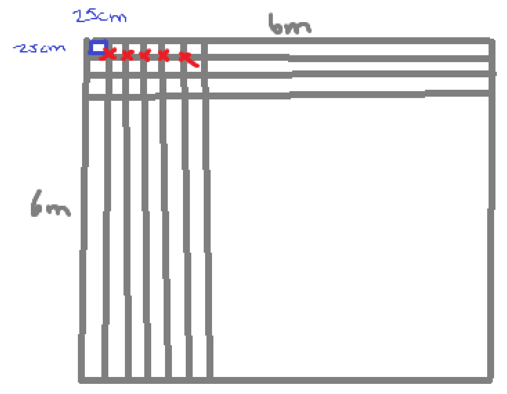
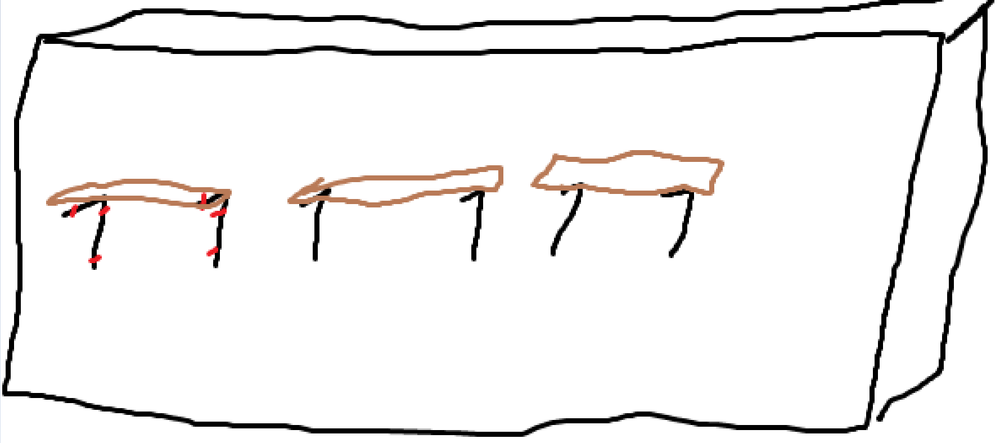

# VR Project Design Document

**Date:** 2025/04/10 \
**Authors:** Kevin Wu & Rida Chaarani  

**Last modified:** 2025/05/08

---

## 1. Application Info

**Tentative Title:**  
**VR Exoskeleton Simulation**

**Category (check all that apply):**

- [x] Education & Training  
- [ ] Mental Health & Fitness  
- [ ] Travel & Discovery  
- [ ] Media & Entertainment  
- [ ] Productivity & Collaboration  
- [ ] Gaming  
- [ ] Art & Creativity  
- [x] Other: Data collection  

---

## 2. Pitch

**Project Goal:**  
To provide a standardized testing platform that evaluates the efficacy of various exoskeleton designs for construction workers. This platform supports task-specific assessments tailored to different types of occupational exoskeletons (OEs), enabling consistent benchmarking under realistic, repeatable conditions. The project builds on the Civil Engineering Master’s thesis by Malcolm Olivera Dunson-Todd at Concordia University, which proposed standardized tests for exoskeletons and exosuits used in construction. It emphasizes sensor-based data collection within a virtual environment to replicate the physical demands and ergonomic risks faced by workers—especially in tasks such as rebar installation—where musculoskeletal disorders (MSDs) are prevalent. By simulating realistic job conditions, this work aims to bridge the gap between lab-based efficacy studies and real-world effectiveness, helping to identify promising OE designs for large-scale adoption and future longitudinal field research.

**Why VR?**  
Virtual reality ensures consistency across test sites by providing a controlled and repeatable simulation environment. Regardless of the physical testing location, the tasks, conditions, and scenarios within the VR simulation remain identical—eliminating variability caused by differing physical environments. This standardization is crucial for generating reliable, comparable data when evaluating exoskeleton performance across multiple locations and user groups. Furthermore, real-life tests are often time-consuming and costly to set up and replicate.

**High-Level User Experience:**  
Users will be capable of selecting different test cases, such as evaluating arm support or back support exoskeletons, tailored to specific tasks. An augmented reality (AR) version of the simulation may also be developed to enhance flexibility and real-world applicability.

Additional stretch goals demanded by the client includes:
- Augmented reality (AR) implementation of the different test cases
- Data collection of users body using IMU sensors
- Real time feedback on the user's positioning during the simulation
- Multiplayer version of the game including player avatars
- ~~Hand tracking~~ **COMPLETED**
- ~~Track task completion time and collect data~~ **COMPLETED**
- Track user's position in real life using QR code or tracking sensors to position the test accordingly

**Targeted Device Capabilities:**  
- 6 degrees of freedom: translational and rotational x, y & z
- Control over movement and rotation of head & controllers  

---

## 3. Basics

**Tutorial Environment:**  
- A dedicated tutorial scene provides users with an introductory video explaining the different controls, navigation and interaction with the test cases. Users can access the test selection menu from their wrist.

**Test Cases:** 
- Back Support Test
- Arm Support Test

**User Navigation:**  
- Users moves by moving in real time in order to simulate real world.  

---

## 4. Events & Interactions

**Feedback:**  
- Haptic/audio feedback on:
  - Task completion
  - Simulation completion  

- visual feedback on:
  - Task progression
  - Task completion
  - Simulation completion

**3D Sound:**  
- Ambient construction site sounds (talking, birds, drills, etc.) 

**Controller Defaults:**  
- Left hand: Direct interactor  
- Right hand: Direct interactor  
- Ray interactor: Not toggleable with thumb stick  

**Main Menu:**  
- Located on the user's wrist  
- User can select a specific test case

**Optional UI Elements:**  
- TBD  

---

## 5. Scenes

### Main Scene

**Purpose:**
To welcome the participant, provide a brief overview of the simulation, video explanation of usage and allow them to choose which exoskeleton scenario to test.

**Interactions:**  
- The user is greeted with a welcome message and brief instructions.  
- Opening the menu on the wrist with pointer action will open a scroll view with the different buttons:
  - **Tutorial** – Loads the tutorial scene.
  - **Back Support** – Loads the back support exoskeleton testing scene.
  - **Arm Support** – Loads the arm support exoskeleton testing scene.
  - **N/A** – Doesn't cause any interaction, only purpose is to be a placeholder replaced once other scenes are added 
- Menu appears next to hand once opened and can be closed.

### Back Support Scene

**Purpose:**  
To evaluate the performance and support of a back support exoskeleton in a simulated rebar-tying task.

**Interactions:**  
- A short tutorial UI is presented at the start to explain the task process.
- The user is placed in a virtual construction zone.
- The task involves tying rebar in a 6m x 6m grid with 25cm spacing between each rebar.
- Visual and/or audio cues guide the user through proper posture and motion.
- Trigger or grab interactions are used to simulate tying actions.
- Progress tracking or task completion feedback will be provided.

### Arm Support Scene

**Purpose:**  
To evaluate the performance and support of an arm support exoskeleton in a drill-based simulation.

**Interactions:**  
- A short tutorial UI is presented at the start to explain the task process.
- The task involves screwing multiple shelfs using a drill held up for an extended amount of time.
- The scene will feature hand-based interactions focused on simulating arm fatigue tasks.
- Trigger or grab interactions will be used as appropriate once the task is finalized.

---

## 6. Optimization & Publishing

**Comfort & Accessibility:**  
- Clear visual cues for interactables  
- Intuitive and simple controls  
- Progress indicators  

**Target Platform:**  
- Oculus Meta Quest (wireless)  

**Performance Targets:**  
- **FPS:** ≥ 60  
- **Milliseconds/frame:** < 16.67 ms  
- **Triangles/frame:** 50k – 100k  
- **Draw calls/frame:** 50 – 200  

**Lighting Strategy:**  
- [ ] All baked  
- [x] Mostly baked with some mixed  
- [ ] All real-time  
- Light probes will be used for more realistic mixed lighting  

---

## 7. Sketch

**Back Support Scene**

**Arm Support Scene**

