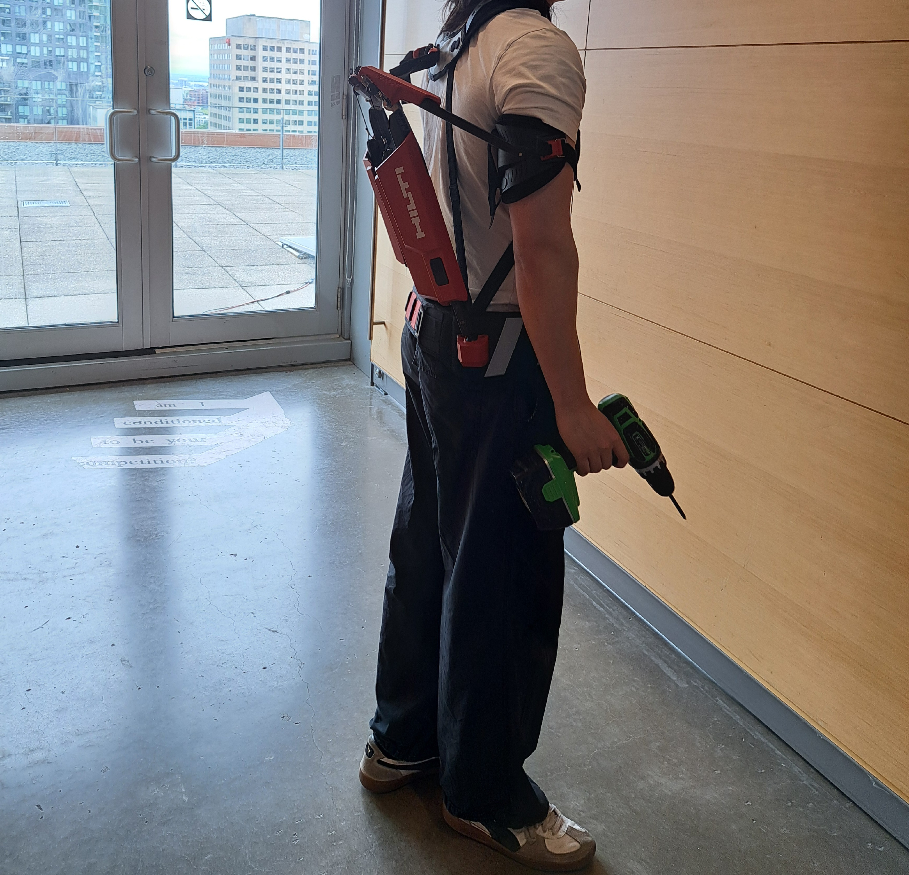

# VRExoskeletonSimulation

## Tech Stack:
 
  

**Platform:** Meta Quest 3 (Android) \
**XR SDK:** Oculus XR Plugin

## Table of Contents

- [Overview](#overview)
- [Features](#features)
- [Controls](#controls)
   - [Controllers](#controllers)
   - [Hands](#hands)
- [Hardware Requirements](#hardware-requirements)
- [How to Run](#how-to-run)
- [How to Find Collected Data](#how-to-find-collected-data)
- [Visuals](#visuals)
- [Future Work](#future-work)
- [Authors and Acknowledgment](#authors-and-acknowledgment)
- [Project status](#project-status)
- [License](#license)

## Overview

This project is a VR testing simulation designed for wireless virtual reality headsets (Tested on the Meta Quest 3) to evolve towards new standardized evaluation of occupational exoskeleton efficacy in construction environments. The simulation enables users to perform realistic, physically dmanding tasks that are tailored to the specific exoskeleton such as tying rebars with a back support exoskeleton. The goal is to have a controlled virtual scenarios in order to assess the efficacy of the different exoskeleton designs through repeatable, measurable test cases.

## Features

#### Core features:

- Back support exoskeleton test case
   - rebar tying simulation of a 6m x 6m with 25cm spacing work zone (625 intersection to tie)
   - simulated construction environment
- Arm support exoskeleton test case
   - shelf building simulation of screwing in two support, 3 screw per support, per shelf
   - simulated room environment
- Tutorial video for:
   - Controls
   - Navigation
   - Rules
   - Test conduction
- Hand tracking (controller free, can freely switch between both modes)
- Direct interactors (no ray interaction, nor teleportation)
- Progress/Completion feedback

## Controls

### Controllers

| Action          | Control                          |  
|-----------------|----------------------------------|  
| Movement        | Joystick                         |  
| Grab            | Grip trigger (side button)       |
| Recenter View   | Oculus button (right controller) |  

### Hands

| Action          | Gesture                          |  
|-----------------|----------------------------------|  
| Grab            | Grab - Close hand around an object |  
| Press           | Point and physically touch it with index finger |
| Recenter View   | Form an "OK" sign (index + thumb touching, facing you) and hold until completed |

## Hardware Requirements

- VR headset (Tested on Meta Quest 3)
- Compatible PC with Meta Quest Link
- Installed Meta Quest app (for developer mode)
- USB-C cable for connecting Quest to PC (if using wired link)
- Exoskeleton

## How to Run

1. **Enable Developer Mode** on your Meta Quest 3:
   - Open the **Meta Quest app** on your mobile device.
   - Go to **Settings > Developer Mode** and enable it.

2. **Connect to PC**:
   - Use **Meta Quest Link** via USB-C or Air Link to connect the headset to your Unity development environment.

3. **Unity Setup**:
   - Install Unity with the **Android Build Support** module.
   - Open the project in Unity Hub.
   - Go to **Edit > Project Settings**
   - Under **XR Plug-in Management**, enable **OpenXR** for Android.
   - Go to **File > Build Settings**.
   - Select **Android** as the platform and click **Switch Platform**.
   

4. **Build and Run**:
   - Connect your headset via USB.
   - Select your headset in the **Build Settings > Run Device** dropdown.
   - Click **Build and Run** to deploy directly to the headset.

## How to Find Collected Data

1. **Connect Your Meta Quest Headset to Your PC**
   - Use a USB-C cable to connect the headset to your computer.

2. **Allow File Access on the Headset**
   - Put on your headset and **allow file transfer** when prompted. This will mount the headset as a storage device on your PC.
   - If no popup appears, it can be found in the notification section of the headset

3. **Navigate to the Headset Storage**
   - Open **File Explorer** on your PC.
   - Look for a device named something like **"Quest"** or **"Meta Quest"** under **This PC**.

4. **Locate the App Folder**
   - Navigate to the following path (may vary slightly depending on your build settings):
     ```
     Quest\Internal shared storage\Android\data\com.company.appName\files\
     ```
   - Replace `com.company.appName` with your actual app's package name.

5. **Find the Data File**
   - Inside the `files` folder, look for the generated `.txt` file (TyingResult_`date_time`.txt).

   1. Open Excel
      - Launch **Microsoft Excel**.
      - Open a **blank workbook**.
   2. Import the Text File
      - Click the **Data** tab in the ribbon.
      - Choose **Get Data** → **From Text/CSV**
      - Locate and select the `.txt` file you just copied.
      - Click **Import**.
   3. Set Import Options
      - In the import preview:
         - Set **Delimiter** to `Comma`.
         - Make sure columns like `index`, `total time`, and `lap time` are separated correctly.
         - Click **Load**.

## Visuals

#### Hand interactive menu


#### Back support rebar grid task


#### Back support environment


#### Arm support shelfs task


#### Arm support environment


#### Arm exoskeleton


## Future Work

[Project Design Document](./ProjectDesign.md) contains a section with the client's demands and stretch goals for the future development of this project.

## Authors and Acknowledgment

**Developed by:** Intern [Kevin Wu](https://github.com/ToasterBuilder) and Intern [Rida Chaarani](https://github.com/RiChaarani)

**Special thanks:** PhD Professor Dr. Amin Hammad and Concordia university for lending and providing access to occupational exoskeletons, virtual reality headsets and other essential resources that made this project possible.

**Based on:** The project builds on the Civil Engineering Master’s thesis by Malcolm Olivera Dunson-Todd at Concordia University, which proposed standardized tests for exoskeletons and exosuits used in construction

## Project status

🚧 **Minimum Viable Product Achieved - Still in Development**  
The core simulation is functional with two distinct test cases (arm support and back support). Users can navigate between scenes, perform different tasks, and collect basic performance data in a controlled VR environment. While the foundation is solid, the project is still under development.

## License

**© 2025 VRExoskeletonSimulation Project Team. All rights reserved.**

This project was developed for academic purposes by interns at Concordia University.

[Back to the top](#vrexoskeletonsimulation)